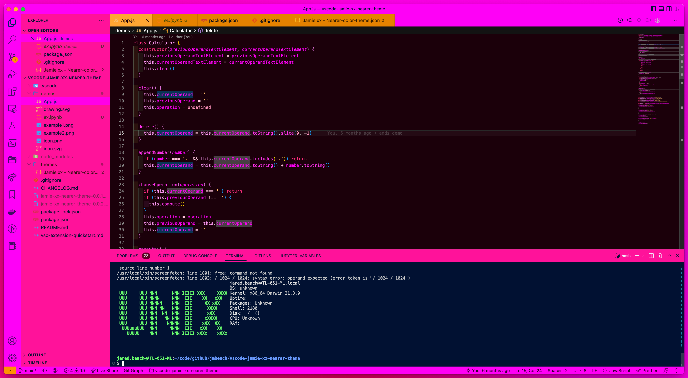
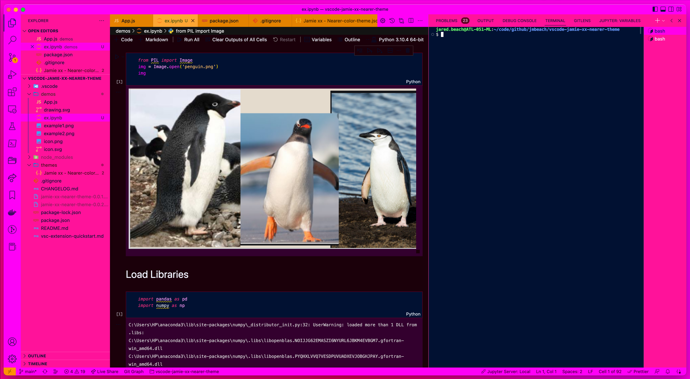

# Jamie xx - Nearer Theme  

A Visual Studio Code theme inspired by [Jamie xx's](https://en.wikipedia.org/wiki/Jamie_xx) EP [Far Nearer / Beat For](https://en.wikipedia.org/wiki/Far_Nearer_/_Beat_For).

## Inspiration

## Theme Demo

